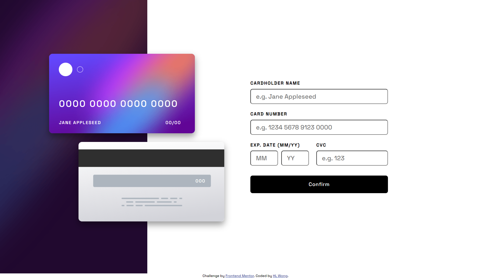
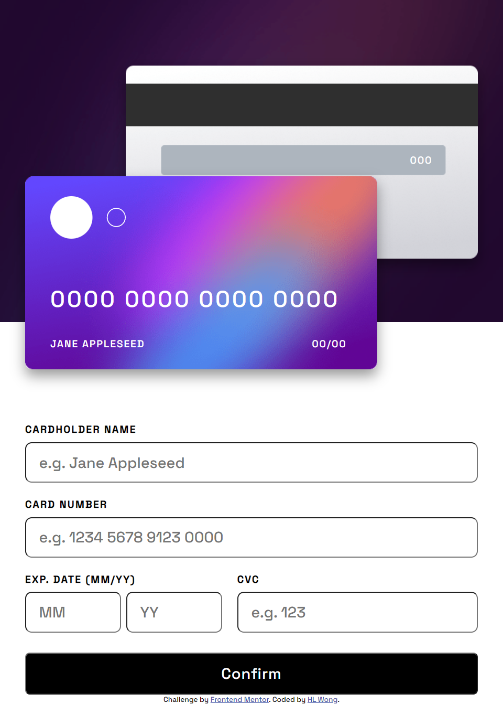
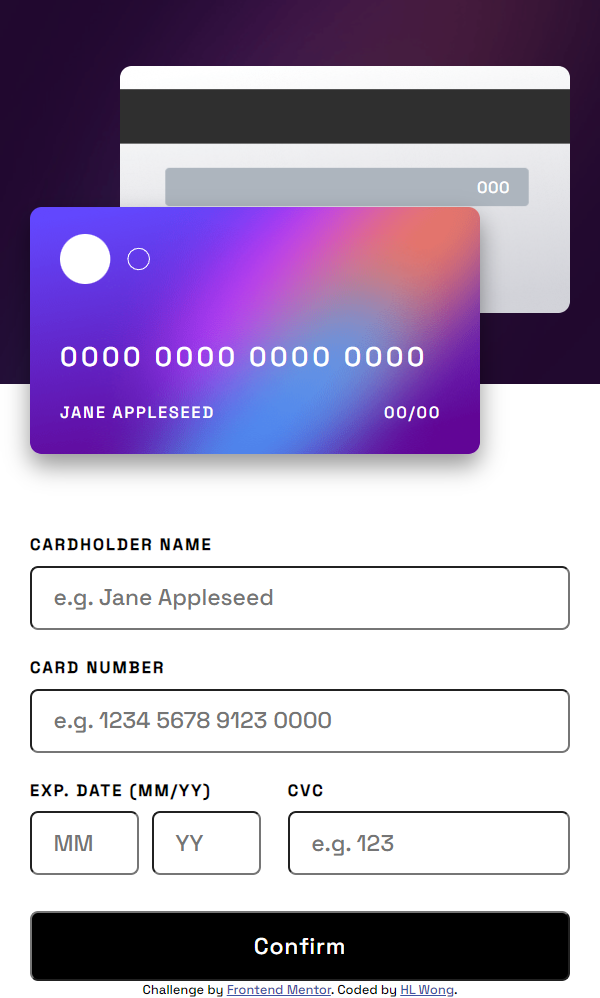

# Frontend Mentor - Interactive card details form solution

This is a solution to the [Interactive card details form challenge on Frontend Mentor](https://www.frontendmentor.io/challenges/interactive-card-details-form-XpS8cKZDWw). Frontend Mentor challenges help you improve your coding skills by building realistic projects. 

## Table of contents

- [Overview](#overview)
  - [The challenge](#the-challenge)
  - [Screenshot](#screenshot)
  - [Links](#links)
- [My Process](#my-process)
  - [Built with](#built-with)
  - [What I learned](#what-i-learned)
  - [Continued development](#continued-development)
- [Author](#author)
- [Acknowledgements](#acknowledgements)

## Overview

### The challenge

Users should be able to:

- Fill in the form and see the card details update in real-time
- Receive error messages when the form is submitted if:
  - Any input field is empty
  - The card number, expiry date, or CVC fields are in the wrong format
- View the optimal layout depending on their device's screen size
- See hover, active, and focus states for interactive elements on the page

### Screenshot

**Desktop Design**

**Tablet Design**

**Mobile Design**

### Links

- Solution URL: [Interactive card details form](https://www.frontendmentor.io/solutions/interactive-card-details-form-OhPURMpEQ0)
- Live Site URL: [Interactive card details form](https://dwz-wong.github.io/interactive-card-details-form/)

## My Process

### Built with

- HTML (Hypertext Markup Language)
- CSS (Cascading Style Sheets)
- JavaScript

### What I learned

In this Frontend Mentor project or challenge, I learned to design a credit card form similar to the preview design provided. Additionally, I have used regex for the credit card form by coding JavaScript in this project or challenge to ensure that users have entered the input in the correct format. When the users didn't enter or have entered the input in the wrong format, it will pop up the error message.

### Continued development

I will keep challenging any challenges or projects to improve my front-end skills in HTML, CSS, and JavaScript.

## Author

- freeCodeCamp - [@dwz_wong](https://www.freecodecamp.org/dwz_wong)
- Frontend Mentor - [@dwz-wong](https://www.frontendmentor.io/profile/dwz-wong)
- Twitter - [@dwz_wong](https://twitter.com/dwz_wong)
